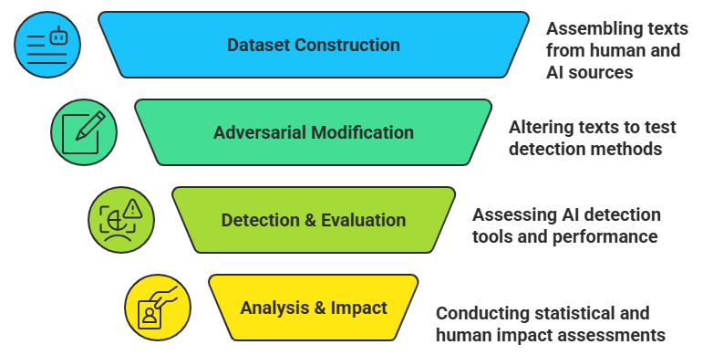
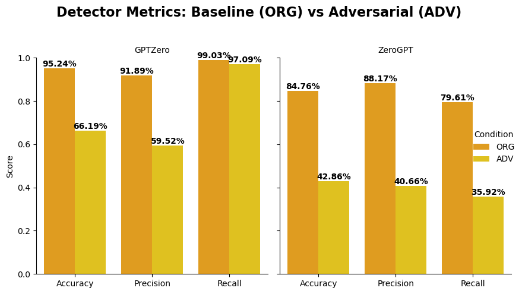
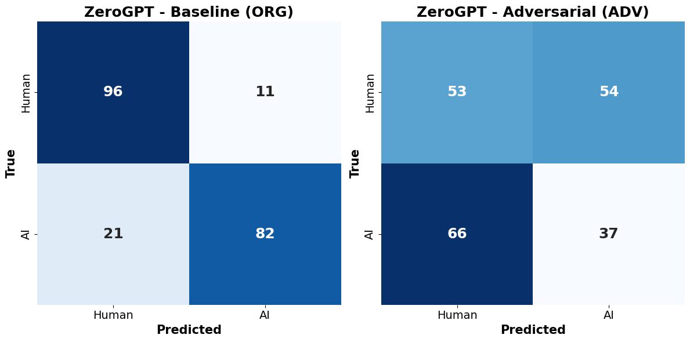
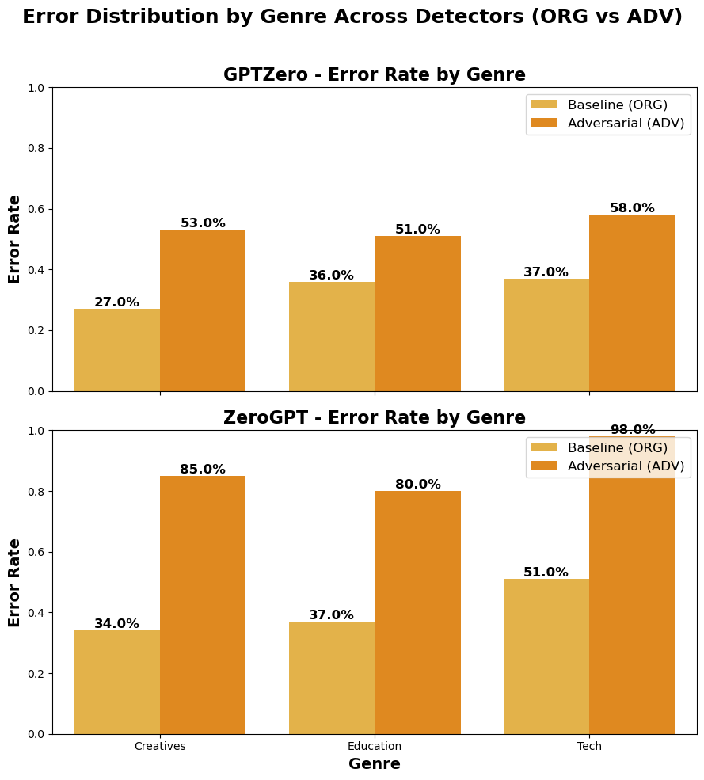
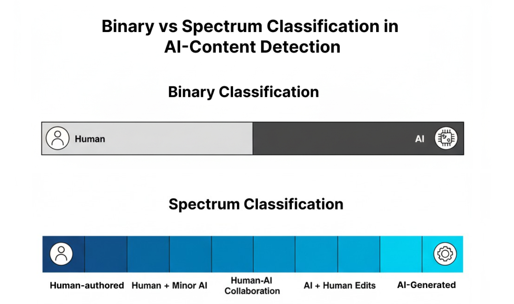

# Deconstructing AI Detection Tools: Accuracy Limits, Bias, and Human Consequences

  
  
  
  
  
  
  
  

**Author:** Sushil Kumar Patra  
**Institution:** Department of Computer Science and Engineering, Apex Institute of Technology, Chandigarh University  
**Collaborators:** Sushant Mahajan, Abhishek Gargya, Vansh Rana, Preeti Khera  
**Project Type:** Academic Research | Adversarial AI | Detection Bias Study

---

## Overview

This repository contains the complete experimental workflow and findings for the research paper  
**“Deconstructing AI Detection Tools: Accuracy Limits, Bias, and Human Consequences.”**

The study evaluates **AI-content detectors** (GPTZero and ZeroGPT) under **dual-direction adversarial edits** across multiple genres.  
It uncovers detection biases, genre-specific weaknesses, and ethical challenges — proposing a **spectrum-based authorship model** to replace traditional binary classification.

---

## Repository Structure

---

## Research Methodology

The methodology integrates **quantitative evaluation** with **ethical and fairness assessment** of AI detectors.

| Stage                        | Description                                                                                          | Tools/Techniques                                                       |
| ---------------------------- | ---------------------------------------------------------------------------------------------------- | ---------------------------------------------------------------------- |
| **Dataset Construction**     | 300 human and 300 AI samples divided equally into _Technical_, _Educational_, and _Creative_ genres. | Manual validation, Genre balancing                                     |
| **Adversarial Modification** | Applied bidirectional edits to simulate both humanized AI and AI-like human text.                    | Paraphrasing (Groq API, Parrot), Back-translation, Typographical Noise |
| **Detection Evaluation**     | Tested GPTZero & ZeroGPT on both original and adversarial datasets.                                  | Accuracy, Precision, Recall, FPR, FNR                                  |
| **Statistical Analysis**     | Measured robustness impact using χ² tests and confidence intervals.                                  | McNemar’s Test                                                         |
| **Ethical Impact**           | Examined human consequences of false detection.                                                      | Case Studies, Surveys                                                  |

---

## Results and Findings

### 1. Detector Performance Comparison

| Detector | Condition         | Accuracy   | Precision | Recall |
| -------- | ----------------- | ---------- | --------- | ------ |
| GPTZero  | Baseline (ORG)    | **95.24%** | 91.89%    | 99.03% |
| GPTZero  | Adversarial (ADV) | **66.19%** | 59.52%    | 97.09% |
| ZeroGPT  | Baseline (ORG)    | **84.76%** | 88.17%    | 79.61% |
| ZeroGPT  | Adversarial (ADV) | **42.86%** | 40.66%    | 35.92% |

Both detectors experienced severe degradation under adversarial edits — highlighting their **low adversarial robustness** and **genre bias**.

---

### 2. Confusion Matrix Insights

#### GPTZero

#### ZeroGPT

| Model   | Condition | TP  | TN  | FP  | FN  |
| ------- | --------- | --- | --- | --- | --- |
| GPTZero | ORG       | 102 | 98  | 9   | 1   |
| GPTZero | ADV       | 100 | 39  | 68  | 3   |
| ZeroGPT | ORG       | 82  | 96  | 11  | 21  |
| ZeroGPT | ADV       | 37  | 53  | 54  | 66  |

---

### 3. Genre-Based Error Distribution

| Detector | Genre     | ORG Error (%) | ADV Error (%) |
| -------- | --------- | ------------- | ------------- |
| GPTZero  | Creatives | 27.0          | **53.0**      |
| GPTZero  | Education | 36.0          | **51.0**      |
| GPTZero  | Tech      | 37.0          | **58.0**      |
| ZeroGPT  | Creatives | 34.0          | **85.0**      |
| ZeroGPT  | Education | 37.0          | **80.0**      |
| ZeroGPT  | Tech      | 51.0          | **98.0**      |

Creative and technical genres show the highest susceptibility to adversarial modification — indicating **genre bias**.

---

### 4. Binary vs Spectrum Classification

**Proposed Framework:**  
`Human → Human + Minor AI → Human–AI Collaboration → AI + Human Edits → AI-Generated`

This continuum better represents hybrid authorship and mitigates ethical risks from rigid binary classification.

---

## Statistical Significance

| Detector | χ² Value | p-value      |
| -------- | -------- | ------------ |
| GPTZero  | 58.14    | < 2.44×10⁻¹⁴ |
| ZeroGPT  | 137.06   | < 1.17×10⁻³¹ |

Both tests confirm adversarial edits significantly alter classification outcomes.

---

## Ethical and Human Impact

Detection tools influence academic and professional decisions, yet they can misclassify genuine human work as AI-generated.

This study underscores:

- Need for **transparency** in AI detection algorithms.
- Importance of **human oversight** in authorship evaluation.
- Urgency for **spectrum-based classification** in AI-era content moderation.

---

## Citation

**Patra, S. K., Mahajan, S., Gargya, A., Rana, V., & Khera, P.**  
_Deconstructing AI Detection Tools: Accuracy Limits, Bias, and Human Consequences._  
Department of Computer Science, Apex Institute of Technology, Chandigarh University, 2025.

---

## Keywords

`AI-content detection` · `adversarial robustness` · `algorithmic fairness` · `human-AI collaboration` · `academic integrity` · `detection bias`

---

## Author’s Note

This project merges **technical experimentation** and **ethical analysis** to show that authorship in the AI age is not binary.  
It calls for spectrum-based detection, fairness, and responsible academic policies.

> “The goal is not to catch AI — but to understand where humanity ends and assistance begins.”
